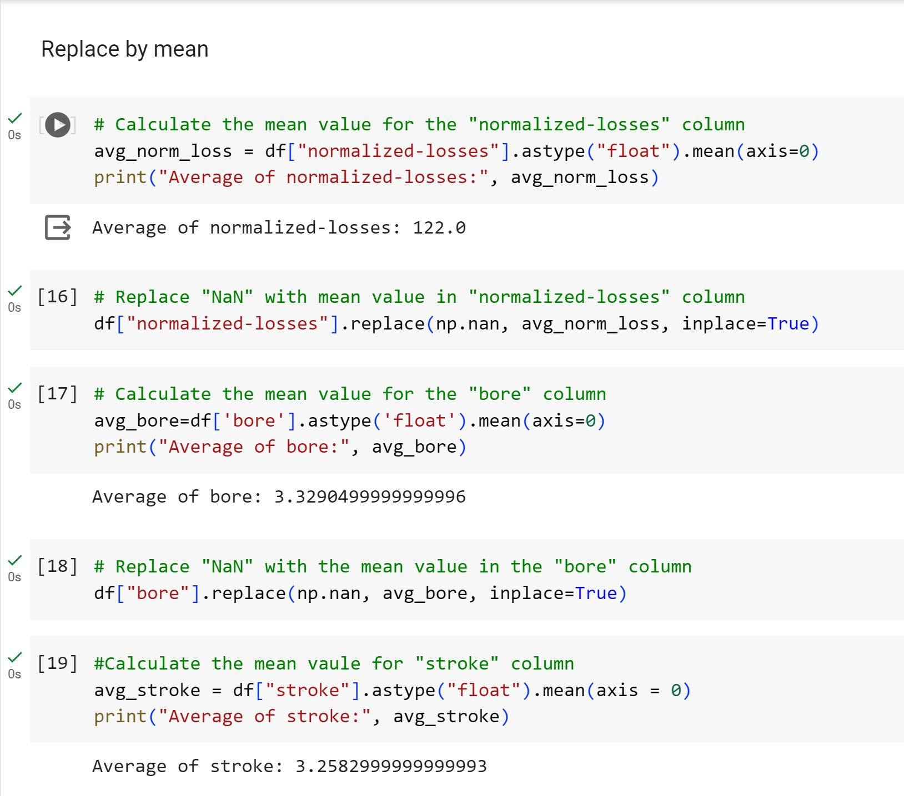

# Data-Wrangling-with-Python

## Overview

This project focuses on data wrangling, a process aimed at transforming data from its initial format to a more suitable format for analysis. We'll be working with the "Automobile Dataset," which involves importing data and addressing specific queries related to fuel consumption rates for diesel cars.

## Purpose of Data Wrangling

Data wrangling is crucial for converting data from its original structure into a format more conducive to analysis. It involves cleaning, transforming, and organizing data to enhance its quality and usability.

## Steps:

### Identifying Missing Values:

The missing values in the dataset are represented by "?".
These "?" values are converted to NaN (Not a Number), which is Python's default missing value marker. This conversion is preferred for computational efficiency.
Evaluating for Missing Data:

Two methods, .isnull() and .notnull(), are used to detect missing data in the dataset.
These methods output boolean values indicating the presence or absence of missing values:
"True" signifies a missing value.
"False" indicates a value present in the dataset.
Counting Missing Values in Each Column:

To count missing values in each column, a for loop in Python is employed.
Within the loop, the method .value_counts() tallies the number of occurrences of "True" values, indicating missing data, in each column.
The process aids in identifying, converting, and counting missing values in the car dataset, crucial for subsequent data cleaning and analysis.

Based on the summary above, each column has 205 rows of data and seven of the columns containing missing data:

"normalized-losses": 41 missing data

"num-of-doors": 2 missing data

"bore": 4 missing data

"stroke" : 4 missing data

"horsepower": 2 missing data

"peak-rpm": 2 missing data

"price": 4 missing data

#### How should you deal with missing data?

**Drop data**

a. Drop the whole row

b. Drop the whole column

**Replace data**

a. Replace it by mean

b. Replace it by frequency

c. Replace it based on other functions

Only drop whole columns if most entries in the column are empty. In the data set, none of the columns are empty enough to drop entirely. There is some freedom in choosing which method to replace data; however, some methods may seem more reasonable than others. Apply each method to different columns:

**Replace by mean**:

***"normalized-losses"***: 41 missing data, replace them with mean

***"stroke"***: 4 missing data, replace them with mean

***"bore"***: 4 missing data, replace them with mean

***"horsepower"*** : 2 missing data, replace them with mean

***"peak-rpm"***: 2 missing data, replace them with mean

**Replace by frequency**:

***"num-of-doors"***: 2 missing data, replace them with "four".

Reason: 84% sedans are four doors. Since four doors is most frequent, it is most likely to occur
Drop the whole row:

***"price"***: 4 missing data, simply delete the whole row

Reason: I want to predict the price. I cannot use any data entry without price data for prediction; therefore any row now without price data is not useful to me.

