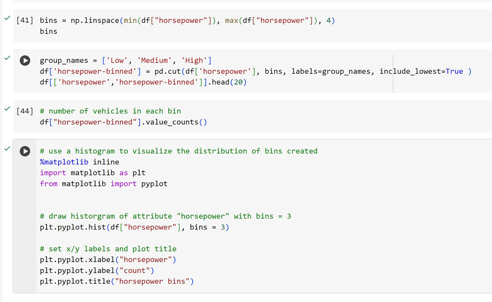

# Data-Wrangling-with-Python

## Overview

This project focuses on data wrangling, a process aimed at transforming data from its initial format to a more suitable format for analysis. We'll be working with the "Automobile Dataset," which involves importing data and addressing specific queries related to fuel consumption rates for diesel cars.

## Purpose of Data Wrangling

Data wrangling is crucial for converting data from its original structure into a format more conducive to analysis. It involves cleaning, transforming, and organizing data to enhance its quality and usability.

## Steps:

### Identifying Missing Values:

The missing values in the dataset are represented by "?".
These "?" values are converted to NaN (Not a Number), which is Python's default missing value marker. This conversion is preferred for computational efficiency.
Evaluating for Missing Data:

Two methods, .isnull() and .notnull(), are used to detect missing data in the dataset.
These methods output boolean values indicating the presence or absence of missing values:
"True" signifies a missing value.
"False" indicates a value present in the dataset.
Counting Missing Values in Each Column:

To count missing values in each column, a for loop in Python is employed.
Within the loop, the method .value_counts() tallies the number of occurrences of "True" values, indicating missing data, in each column.
The process aids in identifying, converting, and counting missing values in the car dataset, crucial for subsequent data cleaning and analysis.

Based on the summary above, each column has 205 rows of data and seven of the columns containing missing data:

"normalized-losses": 41 missing data

"num-of-doors": 2 missing data

"bore": 4 missing data

"stroke" : 4 missing data

"horsepower": 2 missing data

"peak-rpm": 2 missing data

"price": 4 missing data

#### How should you deal with missing data?

**Drop data**

a. Drop the whole row

b. Drop the whole column

**Replace data**

a. Replace it by mean

b. Replace it by frequency

c. Replace it based on other functions

Only drop whole columns if most entries in the column are empty. In the data set, none of the columns are empty enough to drop entirely. There is some freedom in choosing which method to replace data; however, some methods may seem more reasonable than others. Apply each method to different columns:

**Replace by mean**:

***"normalized-losses"***: 41 missing data, replace them with mean

***"stroke"***: 4 missing data, replace them with mean

***"bore"***: 4 missing data, replace them with mean

***"horsepower"*** : 2 missing data, replace them with mean

***"peak-rpm"***: 2 missing data, replace them with mean
.

**Replace by frequency**:

***"num-of-doors"***: 2 missing data, replace them with "four".

Reason: 84% sedans are four doors. Since four doors is most frequent, it is most likely to occur
Drop the whole row:
.

***"price"***: 4 missing data, simply delete the whole row

Reason: I want to predict the price. I cannot use any data entry without price data for prediction; therefore any row now without price data is not useful to me.

### Correcting Data Format

The final step in data cleaning involves ensuring that all data is in the correct format (integer, float, text, or other) for optimal analysis and interpretation.

**Checking Data Type**:

The .dtype() method in Pandas is utilized to examine the data type of each column in the dataset.
It helps in identifying columns with incorrect data types that need adjustment.

**Changing Data Type**:

The .astype() method in Pandas is employed to modify the data type of columns to the appropriate format.
For instance, numerical variables should ideally be of type 'float' or 'int', while categorical variables with strings should be of type 'object'.

**Example Scenario**:

Some columns, such as 'bore' and 'stroke', which describe engine features, are expected to contain numerical values ('float' or 'int').
However, if these columns are shown as 'object' type, it indicates a mismatch in data format.
To rectify this, the "astype()" method is used to convert the data types of respective columns into the correct format.

The process involves checking and adjusting data types to ensure accurate and consistent formats across the dataset for effective analysis.

### Data Standardization

Data collected from various sources often comes in different formats. Standardization, in this context, refers to the transformation of data into a consistent and uniform format, enabling meaningful comparisons and analysis.

**Definition**:

Standardization is the process of converting data into a common format to facilitate accurate comparisons and analysis.

**Example Scenario**:

Transforming MPG to L/100km:

In the dataset, the fuel consumption columns "city-mpg" and "highway-mpg" are measured in mpg (miles per gallon). However, an application is being developed for a country that uses the fuel consumption standard L/100km.

### Data Normalization

Normalization is a technique used to transform values of multiple variables into a similar range. This process involves adjusting variables to adhere to specific scaling parameters, such as:

Scaling variables to achieve an average of 0

Scaling variables to achieve a variance of 1

Scaling variables to ensure values range from 0 to 1

**Purpose**:

Normalization aims to standardize the range of variables, making them comparable and eliminating biases or inconsistencies arising from varying scales.

**Example Scenario**:

Normalizing "Length," "Width," and "Height":

Suppose you have columns in a dataset named "length," "width," and "height" that require normalization to ensure their values fall within a uniform range of 0 to 1.

### Binning
Binning involves categorizing continuous numerical variables into discrete groups or 'bins' to simplify analysis by grouping similar values together.

**Purpose**:

The primary goal of binning is to transform continuous numerical data into categorical bins, enabling easier analysis based on grouped categories.

**Example Scenario**:

Binning "Horsepower":

Suppose in a dataset, the "horsepower" variable is a continuous numerical attribute ranging from 48 to 288, containing 59 unique values. However, for analysis purposes, you're interested in comparing price differences among cars with high, medium, and low horsepower (3 categories).

**Binning Approach**:

Utilizing Pandas' 'cut' method to segment the 'horsepower' column into 3 distinct bins based on predefined criteria.
Converting the data to the correct format and visualizing the distribution by plotting a histogram of the 'horsepower' variable.
Employing Numpy's 'linspace' function to generate 3 bins of equal size bandwidth, indicating the ranges where one bin ends and another starts.
Applying the 'cut' function to assign each 'horsepower' value to its corresponding bin based on predefined criteria.

|distribution of horsepower| distribution of bins created|
|--------------------------|-----------------------------|
|             |                |

### Dummy Variable

A dummy variable is a numerical representation used to label categories within a dataset. These variables are termed 'dummies' because the numbers themselves lack inherent meaning but serve as markers for categorical distinctions.

**Purpose**:

Dummy variables, also known as indicator variables, are employed to convert categorical variables into a numerical format, facilitating their utilization in regression analysis and other statistical modeling techniques.

**Example Scenario**:

Creation of Indicator Variables for "Fuel-Type":
Consider a dataset column named "fuel-type" containing two unique categorical values: "gas" or "diesel." In regression analysis, categorical variables need to be represented numerically. To enable the use of "fuel-type" in regression analysis, it needs to be converted into indicator variables.

**Approach**:

Utilizing Pandas' 'get_dummies' method to transform the categorical variable "fuel-type" into numerical indicator variables representing the different categories (e.g., "gas" and "diesel") as separate columns with binary (0 or 1) values.

## Conclusion

Data wrangling is essential as it lays the groundwork for effective data analysis by improving data quality, compatibility, consistency, and overall usability, ultimately leading to more accurate and valuable insights for decision-making purposes.
